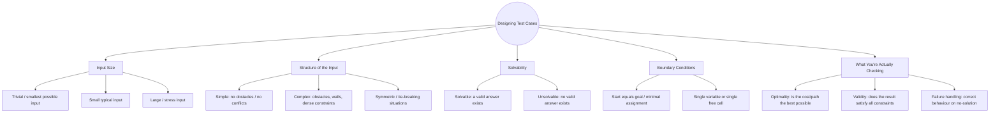

# Mind-Map: How to Think About Test Cases

Every assignment problem in this pack asks you to submit **3 test cases**
per algorithm. This page gives you a map of the *categories* test cases can
come from, so your 3 choices cover meaningfully different ground instead of
being 3 near-duplicates.

## The mind-map

*(This renders as a diagram automatically on GitHub. If you're reading this
in a plain text editor, the indentation above still shows the same tree.)*

## How to use this map

1. Don't pick 3 test cases from the same branch (e.g. 3 different "small
   typical input" cases). That's low coverage even if it *looks* like 3
   tests.
2. Instead, pick cases from **3 different branches**. A strong combination
   for most problems in this pack is:
   - one **typical, solvable** case (Structure → simple, Solvability →
     solvable)
   - one **boundary/edge** case (Boundary → start=goal, or Size → trivial)
   - one **unsolvable or stress** case (Solvability → unsolvable, or
     Size → large)
3. For each test case you submit, write one sentence naming which
   branch(es) it covers and why that's a meaningful thing to check. This is
   part of your submission, not just the code — see
   `../assignments/assignment_wk5_6.md`.

## Applying this to A* and CSP specifically

| Category | A* (pathfinding) example | CSP (map colouring) example |
|---|---|---|
| Trivial/boundary | Start cell = goal cell (path length 0) | A graph with only 1 region (trivially solvable) |
| Typical/solvable | Small grid, one or two walls, clear path exists | 3–4 regions with a few adjacencies, solvable with given colours |
| Unsolvable/stress | Goal is completely walled off — no path exists | Fully connected graph (like the triangle) with too few colours |

See `training_guide.md` for a worked demonstration of deriving 3 test cases
for a brand-new function, step by step.
